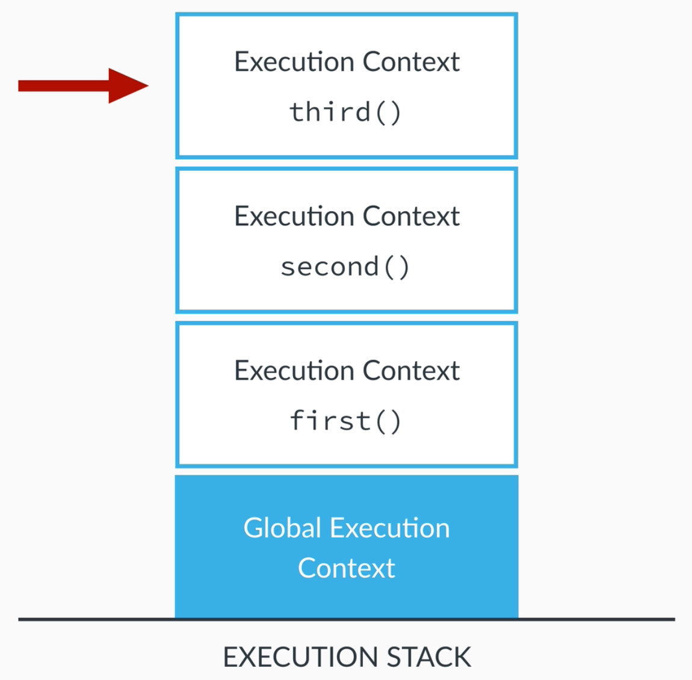

# EXECUTION CONTEXT

Runtime env of code. Container that stores variables and in which code is evaluated and executed.

## Global Execution Context

Default, created before executing any code. Context for any code not inside functions.

Can think of as object, known as **global object**. In browser, it is `window` object.

```javascript
lastName === window.lastName  // true
```

## Functional Execution Context

Every time function called, gets its own context, pushed to top of **execution stack**. Top of stack is always active context.



## Creating Context

**Execution Context Object** contains:

* **Variable Object (VO)**
  * Func args, inner vars, func declarations.
* **Scope Chain**
  * Current VO and VOs of all parents.
* `this`

1. Creation phase:
   * Creation of VO
   * Creation of scope chain
   * Determine value of `this`
2. Execution phase:
   * Code of func that generated current context executed line by line

## Variable Object

1. Arg obj created, containing all args passed to func.

2. Code scanned for func declarations. In VO, creates 1 prop per func, pointing to func. I.e., all funcs stored inside VO, before execution.

3. Code scanned for var declarations. In VO, creates 1 prop per var, set to `undefined`.

Steps 2 and 3 are referred to as _hoisting_. Funcs and vars are hoisted in JS, meaning they're available before execution. However, funcs are set up, but vars are undefined (only defined in execution phase).
